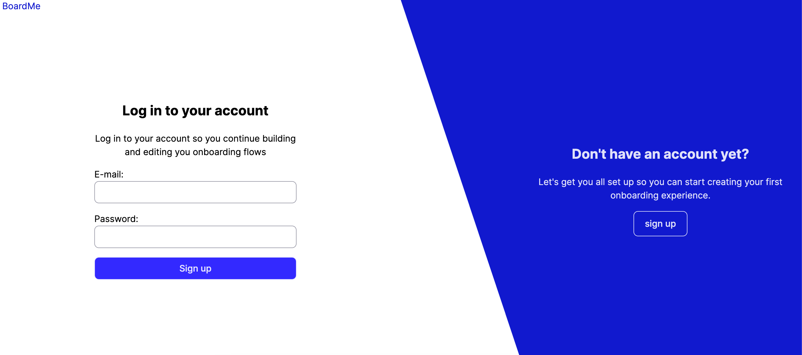
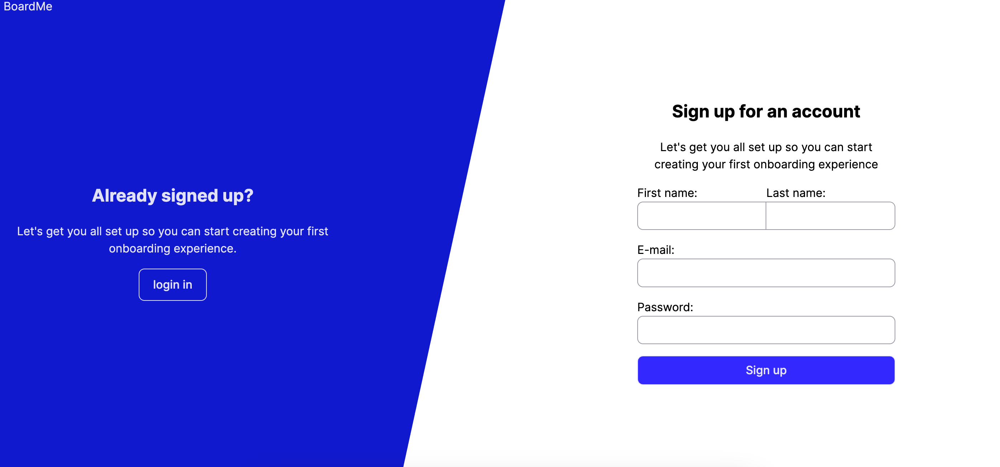

# 🔐 Auth2 — Accessible Login & Sign-up Demo

A small authentication demo app built with **React**, **TypeScript**, and **Vite**.  
This project was created to demonstrate best practices in frontend engineering:  
accessible HTML forms, async UX, error handling, view transitions, and testing.
---

## ✨ Features

- **Login & Signup forms**
  - Name, email, and password fields
  - Native HTML validation with accessible error messages
  - `aria-invalid` + `aria-errormessage` for screen readers
- **Async mock API**
  - `mockFetch` simulates network latency and random failures
  - Prevents double submits (`button` disabled while loading)
  - Displays server error state with `<Alert>`
  - Redirects to `/dashboard` on success
- **Animations**
  - Uses the [View Transitions API](https://developer.chrome.com/docs/web-platform/view-transitions) for smooth page animations
- **Clean CSS architecture**
  - Variables (`--primary`, `--error`, etc.)
  - Responsive layout (`@media screen and (max-width: 768px)`)
  - Accessible focus states
- **Testing**
  - Unit tests with [Vitest](https://vitest.dev) + [React Testing Library](https://testing-library.com/)
  - Covers rendering, validation, loading, error, and success flows

---
💡 Note: For this demo, all CSS lives in a single file for simplicity.

## 📸 Screenshots

| Login                          | Sign-up                           |
|--------------------------------|-----------------------------------|
|  |  |

---

## 🚀 Demo

👉 [Live Demo on GitHub Pages](https://sergeyvinogorov.github.io/auth2)

---

## 🛠 Tech Stack

- **React 18** + **TypeScript**
- **Vite** for bundling
- **ESLint + Prettier** for code style
- **CSS** with OKLCH colors

---

## 🚀 Getting Started

### Prerequisites
- Node.js v18+
- npm or pnpm

### Install dependencies
```bash
  npm install
````

### Run dev server
```bash
  npm run dev
```
Open http://localhost:5173

### Run tests
```bash
  npm run test
```

---

### ✅ Tests

This project uses [Vitest](https://vitest.dev) + [React Testing Library](https://testing-library.com/docs/react-testing-library/intro/) with `jsdom`.

Currently covered:

- Form rendering (inputs and submit button)
- Client-side validation (required fields)
- Loading state (button disabled during submit)
- Server error handling (mocked API failure)

---

## 👨‍💻 Author

**Sergei Vinogorov**
- ✉️ webdev.vinogorov@gmail.com
- 🌐 [vinogorovs.site](https://vinogorovs.site)
- 💼 [LinkedIn](https://www.linkedin.com/in/sergei-vinogorov/)
- 🐙 [GitHub](https://github.com/SergeyVinogorov)
